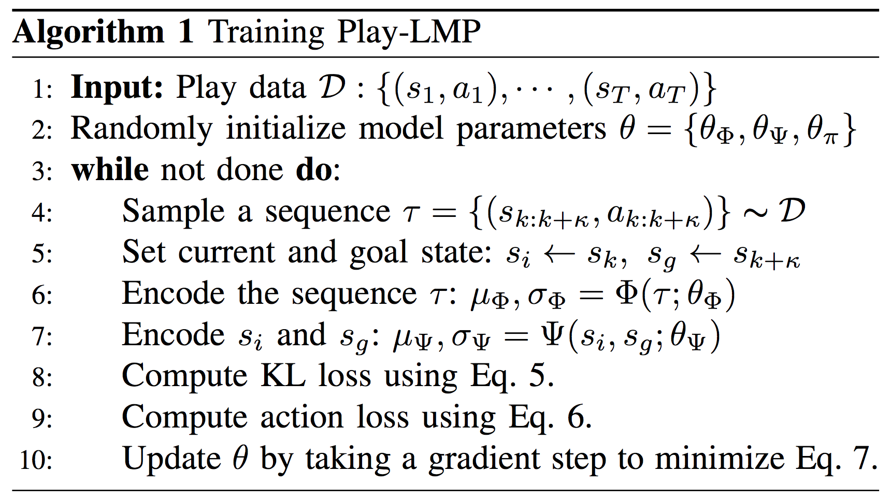
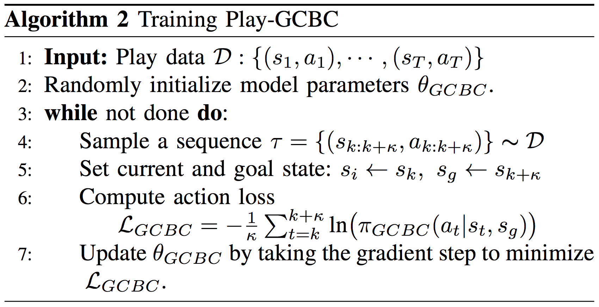
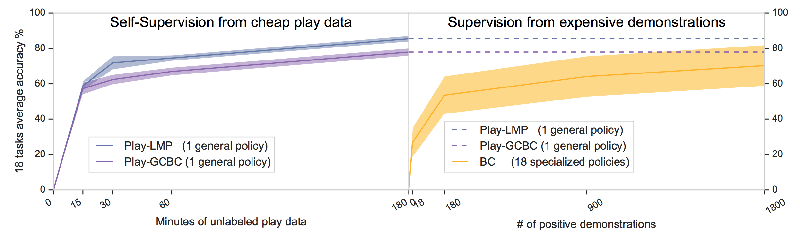
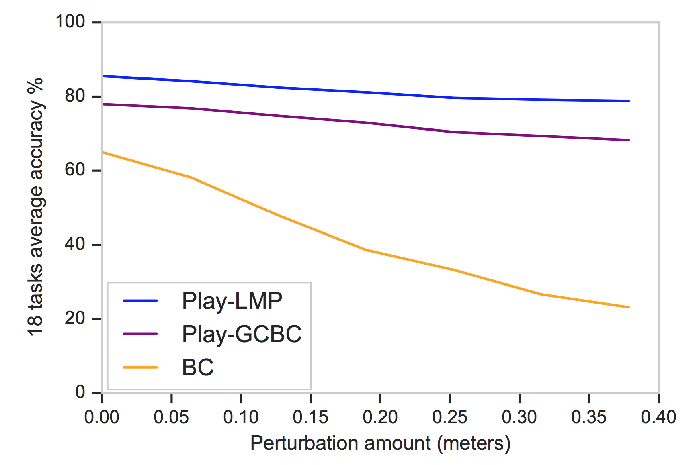
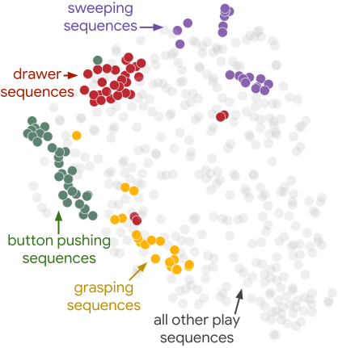

## Abstract

We propose learning from teleoperated play data as a way to scale up multi-task robotic skill learning.  **Learning from play (LfP)** offers three main advantages: 1) *It is cheap*. Large amounts of play data can be collected quickly as it does not require scene staging, task segmenting, or resetting to an initial state. 2) *It is general*. It contains both functional and non-functional behavior, relaxing the need for a predefined task distribution. 3) *It is rich*. Play involves repeated, varied behavior and naturally leads to high coverage of the possible interaction space. These properties distinguish play from expert demonstrations, which are rich, but expensive, and scripted unattended data collection, which is cheap, but insufficiently rich. Variety in play, however, presents a multimodality challenge to methods seeking to learn control on top. To this end, we introduce **Play-LMP**, a method designed to handle variability in the LfP setting by organizing it in an embedding space. Play-LMP jointly learns 1) reusable *latent plan representations* unsupervised from play data and 2) a *single goal-conditioned policy* capable of decoding inferred plans to achieve user-specified tasks. We show empirically that Play-LMP, despite not being trained on task-specific data, is capable of generalizing to 18 complex user-specified manipulation tasks with average success of 85.5%, outperforming individual models trained on expert demonstrations (success of 70.3%). Furthermore, we find that play-supervised models, unlike their expert-trained counterparts, 1) are more *robust* to perturbations and 2) exhibit *retrying-till-success*. Finally, despite never being trained with task labels, we find that our agent learns to organize its latent plan space around functional tasks.

[here]: https://learning-from-play.github.io

<video class="b-lazy" data-src="assets/mp4/lmp_8tasks960x400.mp4" type="video/mp4" autoplay muted playsinline loop style="display: block; width: 100%;"></video>
<figcaption>
Figure 1: a single Play-LMP policy (right) performing 8 tasks in a row by being conditioned on 8 different goals provided by the user (right).
</figcaption>

______

<figcaption>
Figure 2. Play-LMP: A single model that self-supervises control from play data, then generalizes to a wide variety of manipulation tasks. Play-LMP 1) samples random windows of experience from a memory of play data. 2) learns to recognize and organize a repertoire of behaviors executed during play in a latent plan space, 3) trains a policy, conditioned on current state, goal state, and a sampled latent plan to reconstruct the actions in the selected window.
Latent plan space is shaped by two stochastic encoders: plan recognition and plan proposal. Plan recognition takes the entire sequence, recognizing the exact behavior executed. Plan proposal takes the initial and final state, outputting a distribution over all possible behaviors that connect initial state to final. We minimize the KL divergence between the two encoders, making plan proposal assign high likelihood to behaviors that were actually executed during play.
</figcaption>

## Introduction

There has been significant recent progress showing that robots can be trained to be competent specialists, learning individual skills like grasping (<dt-cite key="kalashnikov2018qt">Kalashnikov et al.</dt-cite>), locomotion and dexterous manipulation (<dt-cite key="haarnoja2018soft">Haarnoja et al.</dt-cite>). In this work, we focus instead on the concept of a generalist robot: a single robot capable of performing many different complex tasks without having to relearn each from scratch--a long standing goal in both robotics and artificial intelligence.

**Learning from play** is a fundamental and general method humans use to acquire a repertoire of complex skills and behaviors (<dt-cite key="wood2005play">Wood and Attfield</dt-cite>). It has been hypothesized <dt-cite key="pellegrini2007play,robert1981animal,hinde1983ethology,sutton2009ambiguity"></dt-cite> that play is a crucial adaptive property--that an extended period of immaturity in humans gives children the opportunity to sample their environment, learning and practicing a wide variety of strategies and behaviors in a low-risk fashion that are effective in that niche.

**What is play?**
Developmental psychologists and animal behaviorists have offered multiple definitions <dt-cite key="burghardt2005genesis,robert1981animal,hinde1983ethology,pellegrini2002children,sutton2009ambiguity"></dt-cite>. <dt-cite key="burghardt2005genesis">Burghardt</dt-cite>, reviewing the different disciplines, distills play down to "a non-serious variant of functional behavior" and gives three main criteria for classifying behavior as play: 1) *Self-guided*. Play is spontaneous and directed entirely by the intrinsic motivation, curiosity, or boredom of the agent engaging in it. 2) *Means over ends*. Although play might resemble functional behavior at times, the participant is typically more concerned with the behaviors themselves than the particular outcome. In this way play is "incompletely functional". 3) *Repeated, but varied*. Play involves repeated behavior, but behavior that cannot be rigidly stereotyped. In this way, play should contain multiple ways of achieving the same outcome. Finally, all forms of play are considered to *follow* exploration (<dt-cite key="belsky1981exploration">Belsky and Most</dt-cite>). That is, before children can play with an object, they must explore it first (<dt-cite key="hutt1966exploration">Hutt</dt-cite>), inventorying its attributes and affordances. Only after rich object knowledge has been built up to act as the bases for play does play displace exploration.

**Play-supervised Robotic Skill Learning:**
In this work, we propose *learning from play* data (LfP), or *"play-supervision"*, as a way to scale up multi-task robotic skill learning. We intend to learn goal-conditioned control on top of a large collection of unscripted robot play data.
But how do we define and implement robotic play, with all the same crucial properties of play previously identified? Voluntary and varied object interaction could in principle be collected by any agent equipped with 1) curiosity, boredom, or some intrinsic motivation drive <dt-cite key="forestier2017intrinsically,sansone2000intrinsic,schmidhuber1991possibility"></dt-cite> and 2) a foundational understanding of object behavior to guide play, such as intuitive physics (<dt-cite key="spelke2007core">Spelke and Kinzler</dt-cite>) and prior knowledge object attributes and affordances gained through exploration. However, building such agents is a challenging open problem in robotics.

Instead, we collect a robot play dataset by allowing a user to teleoperate the robot in a playground environment, interacting with all the objects available in as many ways that they can think of. A human operator provides the necessary properties of curiosity, boredom, and affordance priors to guide rich object play. Human exploration and domain knowledge allow us to avoid the question of learning how *to* play, and rather focus entirely on what can be learned *from* play.

We show examples of the play data fed into our system in Figure 3. We underline that this data is not task specific, but rather intends to cover as much as possible of the full object interaction space allowed by the environment. Play is typically characterized along object, locomotor, and social dimensions (<dt-cite key="burghardt2005genesis">Burghardt, 2005</dt-cite>). While there is nothing in principle that stops us from applying our methods to, say, locomotion play or combined locomotion and object play, in this work we focus on object play.

<video class="b-lazy" data-src="assets/mp4/play_data516x360.mp4" type="video/mp4" autoplay muted playsinline loop style="display: block; width: 70%;"></video>
<figcaption>
Figure 3: Play data collected from human tele-operation.
</figcaption>

**Benefits of Play Data For Robotics**
Supervision of complex robotic skills by humans is possible, but expensive. In the learning from demonstration (LfD) setting, one can collect expert teleoperation demonstrations for each skill (Figure 4.) and train the robot to imitate the behavior. This first requires one to come up with a rigid, constrained and discrete definition of each skill that is important. If a slight variation of the skill is needed, e.g. opening a drawer by grasping the handle from the top down rather than bottom up, an entirely new set of demonstrations might be required. Additionally, if the agent is expected to compose multiple tasks in a row, e.g. opening a drawer, placing an object inside, and closing it, the researcher may need to collect demonstrations of transitions between all pairs of skills. In short, achieving flexible multi-task skill learning in an LfD setting would require a substantial and expensive human effort.

A number of recent works have attempted to sidestep the expensive demonstration effort, learning single or multi-task robotic control from unattended, scripted data collection (<dt-cite key="DBLP:journals/corr/AgrawalNAML16,DBLP:journals/corr/NairCAIAML17,pinto2015supersizing,levine2017grasping,ebert2018visual,pathakICLR18zeroshot"></dt-cite>). While highly scalable, the complexity of the skills that can be learned depends on the complexity of what can be reasonably scripted. In <dt-cite key="ebert2018visual">Ebert et al.</dt-cite> for example, the skills that emerged from random robot arm movement in a bin of objects was found to be generally restricted to pushing and dragging objects. This is to be expected, as sampling random actions is very unlikely to traverse through more complex manipulations by chance. To remedy this, the authors made more complex skills such as grasping more likely by adding ``drop and grasp" primitives to the unsupervised collection process. In general, in the scripted collect paradigm, for each new complex skill a robot is required to perform, a corresponding and sizeable effort must go into scripting a new primitive that results in the skill happening by chance frequently during unattended collection.

In summary, if a robot needs to perform multiple complex tasks, expert demonstrations can be sufficiently rich, but are not scalable, and scripted collection is highly scalable, but not sufficiently rich.
Instead, we argue that data collected from a user playing through teleoperation (LfP), is both scalable and complex enough to form the basis for large scale multi-task robotic skill learning:
* *Play data is cheap*. Teleoperation play data involves no scene staging, no task segmenting, and no resetting the scene to an initial state. This means it can be collected in large quantities quickly and cheaply. This represents a much more scalable alternative to segmented task demonstrations, the conventional inputs to imitation learning algorithms (an example of which is shown in Figure 4.) which must be staged, segmented, and reset.
* *Play data is general*. Play relaxes the need for a discrete, predefined task distribution. Instead play contains a continuum of behaviors, functional and non-functional.
* *Play data is rich*. The "repeat but varied" and "means over ends" properties of play naturally lead to high coverage of the possible interaction space. Since the behavior is driven by the curiosity and the boredom of the operator, it is expected to be naturally diverse (an operator will get bored opening a door the same way every time, and might try different behaviors). Furthermore, play follows exploration, and is guided by rich object attribute and affordance knowledge. This means play behavior should preserve this attribute knowledge, e.g. stacking cups, squeezing a toy, or rolling a ball. This represents a much more complex and discriminate set of interactions than what is typically available in a scripted robotic collection setting, which tends to yield indiscriminate pushing or object dragging.

In summary, we argue (and will show empirically) that play data strikes a good balance on the cost-richness tradeoff: it is highly rich, containing repetition of complex, prior-guided behaviors and many different ways of achieving the same outcome. It is also cheap, since it can be collected continuously without upfront task definition, scene staging or resetting.

<video class="b-lazy" data-src="assets/mp4/close_sliding_demo.mp4" type="video/mp4" autoplay muted playsinline loop style="display: block; width: 70%;"></video>
<figcaption>
Figure 4: Example of an expert demonstration collected for the "close sliding door" task.
</figcaption>

**Self-supervising control on top of play data**
Our aim in this work is to make it feasible to learn a general-purpose control policy: a policy that can flexibly achieve a wide range of complex user-specified tasks, using as inputs only inexpensive play data with no  predetermined constraints. We rely on a simple structure in the data to provide self-supervision for training such policies: a random sequence of state-actions extracted from play memory describes exactly how the robot got from a particular initial state to a particular final state. This provides a synthetic labelling to train a general goal-conditioned policy, by treating the initial state of the sequence as "current state", the final state as "goal state", and the actions taken as the targets to reproduce. Furthermore, as shown in Figure 3, even though play data in general is considered "incompletely functional", subsequences mined from play data can be considered to be a noisy, but plentiful source of *non-expert functional demonstrations*.

Note that in this context, "self-supervision" refers to the autonomous labeling scheme for a supervised training of goal-conditioned policies, *not* unattended data collection. Specifically, it is not to be confused with recent "self-supervised robotics" work, where unattended, scripted robotic data collection is used to learn skills such as grasping <dt-cite key="DBLP:journals/corr/AgrawalNAML16,DBLP:journals/corr/NairCAIAML17,pinto2015supersizing,levine2017grasping,ebert2018visual,pathakICLR18zeroshot"></dt-cite>

**Organizing play behavior in a latent plan space**
Play, by definition, is highly varied, containing repeated, non-stereotyped object interaction. Intuitively, there are many ways of achieving the same outcome in a scene--for example opening a door quickly or slowly, grasping the top of the handle or the bottom of the handle--and an agent or operator playing in a scene should explore them all. This presents a *multimodal representation learning challenge*: policies must be expressive enough to model all the possible solutions to a given goal.
Our approach, described in the section titled "Plan Proposer", models this variation explicitly, by learning to recognize a repertoire of reusable behaviors from play unsupervised and organize them in an embedding space. We can think of a single point in this space as representing an entire behavior our agent executed to get from a particular current state to a particular goal state. Local regions should correspond to distinct solutions to the same task. The motivation is to make learning goal-conditioned policies substantially easier: policies no longer need to encode the full knowledge of how to to traverse state space, rather they just need to learn how to accurately decode reusable latent plans.

In this paper, we introduce the following contributions:
* Learning from play (LfP), or "play-supervision", a paradigm for scaling up multi-task robotic skill learning by self-supervising on cheap and rich user teleoperated play data. We show empirically its benefits over learning from segmented demonstrations (LfD), especially in regards to scalability, robustness to perturbations, and failure recovery.
* Play-LMP, a method that jointly learns 1) reusable latent plan representations from play data and 2) goal-conditioned control capable of generalizing to a wide variety of complex user-specified manipulation tasks.

## Method

**Play data**&nbsp;&nbsp;

Consider play data, an unbounded sequence of states and actions corresponding to voluntary, repeated, non-stereotyped object interaction between an agent and it's environment.

$\mathcal{D} = \{(s_1, a_1), (s_2, a_2), \cdots, (s_T, a_T)\}$

In our experiments, we define play data as the states and actions logged during human play teleoperation of a robot in a playground environment. Find an example of such data in Figure 3.

<figcaption>
Figure 5: 
Task-agnostic policy inference.
The policy is conditioned on a latent plan which is sampled once from a plan distribution (inferred from the current and goal states).
The policy is also conditioned on the current state as well as the goal state desired by the user.
</figcaption>

**Play-LMP**&nbsp;&nbsp;
As described earlier, play is characterized as repeated object interaction that cannot be rigidly stereotyped. In this way, play can be expected to contain multiple ways of achieving the same outcome. An operator playing in an environment with a door isn't looking for the most efficient way to open it repeatedly. They will rather, through the course of curiosity or boredom, naturally experiment with the many ways the door can be opened--fast, slow, by grasping the top of the handle, the bottom of the handle etc. Intuitively, there are many distinct behaviors that might take an agent from a particular initial state to a particular final state.
The presence of multiple action trajectories for the same (current state, goal state) pair presents a challenge to models seeking to learn goal-conditioned control in the form of counteracting action labels.
This can be considered a multimodal representation learning problem: policies must be powerful enough to model all possible high-level behaviors that lead to the same goal outcome.

With this motivation in mind, we introduce Play-LMP (play-supervised latent motor plans), a hierarchical latent variable model for learning goal-conditioned control.
Play-LMP simultaneously learns 1) *reusable latent plan representations* from play data and 2) *plan and goal-conditioned policies*, capable of decoding learned latent plans into actions to reach user-specified goal states.
We call the representation space learned by Play-LMP "latent plan space". The intent is that individual points in the space correspond to behaviors recognized during play that got the agent from some initial state to some final state. We call points in the space "latent plans" because a single point should carry the necessary information for how to act, should it find itself at some point in the future in a similar initial state, trying to reach a similar goal state. That is, the embedding space is designed for efficient reuse.

Local regions of plan space should correspond to distinct solutions to the same task. In this way, we aim for Play-LMP to explicitly model the "multiple solutions'' problem in play data, relieving the policy of that effort. That is, a policy conditioned on current state, goal state, and *latent plan* only needs to learn how to follow the specific plan. Ideally, latent plans provide *disambiguating* information to the policy, turning a multimodal representation learning problem into a unimodal one. Hence, we aim for Play-LMP to recognize a repertoire of reusable behaviors simply by passively recalling play experience, then invoke them at test time to solve user-specified tasks.
Finally we note that although Play-LMP was designed to ameliorate multimodality issues in play data, it is a general self-supervised control learning method that could in principle operate on any collection of state-action sequences.

Concretely, our training method consists of three modules:
* *Plan Recognizer* $\Phi$: A stochastic sequence encoder that takes a randomly sampled play sequence $\tau$ as input, mapping it to a distribution in latent plan space $q_{\Phi}(z|\tau)$. The motivation of this encoder is to act as "recognition" network, identifying which region of latent plan space the behavior executed during the play sequence belongs to. $\Phi$ is used only at training time to extract latent plan representations from the unlabeled data. This can be interpreted as a learned variational posterior over latent plan states.
* *Plan Proposer* $\Psi$: A stochastic encoder taking the initial state $s_i$ and final state $s_g$ from the same sampled sequence $\tau$, outputting distribution $p_{\Psi}(z|s_i, s_g)$. The goal of this encoder is to represent the full distribution over behaviors that connect the current state to the goal state, potentially capturing multiple distinct solutions. This can be interpreted as a learned conditional prior.
* *Goal and plan conditioned policy* $\pi$: A policy conditioned on the current state $s_t$, goal state $s_g$, and a latent plan $z$ sampled from $\Phi$, trained to reconstruct the actions the agent took during play to reach the goal state from the initial state, as described by inferred plan $z$.

We now describe each of the modules in detail and the losses used to train them. For a visual description of the training procedure, see Figure 2.

**Plan Recognizer**&nbsp;&nbsp;
Consider a sequence of state action pairs $\tau$ of window length $\kappa$ sampled at random from the play dataset $\mathcal{D}$:

$\tau = \{(s_{k:k+\kappa}, a_{k:k+\kappa})\} \thicksim \mathcal{D}$

We define a stochastic sequence encoder, $\Phi$, referred to throughout the paper as the "plan recognizer", which takes as input $\tau$ and outputs a distribution over latent plans. Intuitively, the idea is for the encoder not to learn to recognize plan codes as single points, but as
ellipsoidal regions in latent space, forcing the codes
to fill the space rather than memorizing individual training data. We parameterize our sequence encoder $\Phi$ with a bidirectional recurrent neural network with parameters $\theta_\Phi$, which produces means and variances in latent plan space from $\tau$.

$\mu_\Phi, \sigma_\Phi = \Phi(\tau, \theta_\Phi)$

As is typical with training VAEs, we assume the encoder has a diagonal covariance matrix, i.e. $z \sim N(\mu_\Phi, diag(\sigma_\Phi^2))$.
Individual latent plans $z$ are sampled from this distribution at training time via the "reparameterization trick" (<dt-cite key="kingma2013auto"></dt-cite>) and handed to a latent plan and goal conditioned action decoder (described in the next section) to be decoded into reconstructed actions. The sequence encoder is then trained with action reconstruction loss $\mathcal{L}_{\pi}$ and the self-supervised
While we could in principle use the sequence encoder at test time to perform full sequence imitation, in this work we restrict our attention to tasks specified by individual user-provided goal states. Therefore, the sequence encoder is only used at training time to help learn a latent plan space, and is discarded at test time.

**Plan Proposer**&nbsp;&nbsp;
We also define a plan proposal network, $\Psi$, which maps initial state $s_i$ and goal state $s_g$ to a distribution over latent plans. The goal of this network is to output the full distribution of possible plans or behaviors that an agent could execute to get from a particular initial state to a particular goal state. We parameterize the plan encoder $\Psi$ with a multi-layer neural network with parameters $\theta_\Psi$, which produces means $\mu_\Psi$ and variances $\sigma_\Psi$ in latent plan space from the $s_i$ to $s_g$. For simplicity, we choose a unimodal multivariate Gaussian to represent distributions in latent plan space; nothing in principle stops us from using more complicated distributions. 

$\mu_\Psi, \sigma_\Psi = \Psi(s_i, s_g; \theta_\Psi)$

Similarly we assume the plan encoder has a diagonal covariance matrix, i.e. $z \thicksim \mathcal{N}(\mu_\Psi, diag(\sigma_\Psi^2))$. Note that $\Psi$ is a stochastic encoder, which outputs a distribution in the same latent plan space as $\Phi$. Both $\Phi$ and $\Psi$ are trained jointly by minimizing the KL divergence between the two distributions:

$\mathcal{L}_{KL} = KL\Big(\mathcal{N}(z|\mu_\Phi, diag(\sigma_\Phi^2)) ~||~ \mathcal{N}(z|\mu_\Psi,diag(\sigma_\Psi^2)) \Big)$

Intuitively, $\mathcal{L}_{KL}$ forces the plan distribution output by the planner $\Psi$ to place high probability on actual latent plans recognized during play. Simultaneously it enforces a regular geometry over codes output by the plan recognizer $\Phi$, allowing plausible plans to be sampled at test time from regions of latent space that have high probability under the conditional prior $\Psi$.

**Task agnostic, goal and latent plan conditioned policy**&nbsp;&nbsp;
Here we describe how we train our task-agnostic policy to achieve user-specified goals. Our policy $\pi$, parameterized by $\theta_\pi$, is an RNN that takes as input current state $s_t$, goal state $s_g$, and a sampled latent plan $z$, and outputs action $a_t$.
The policy is trained via maximum likelihood to reconstruct the actions taken during the sequence sampled from play.
To obtain action predictions at training time, we sample $z$ once from the distribution output by $\Phi$ (which has been conditioned on the entire state-action sequence $\tau$), then for each timestep $t$ in the sequence, we compute actions $a_t$ from inputs $s_t$, $s_g$, and $z$. The loss term $\mathcal{L}_{\pi}$ corresponding to the action prediction is determined as follows:

$\mathcal{L}_\pi = -\frac{1}{\kappa} \sum_{t=k}^{k+\kappa} log\big(\pi(a_t | s_t, s_g, z)\big)$

Note that we can optionally also have the decoder output state predictions, and adds another loss term penalizing a state reconstruction loss.

As mentioned earlier, at test time $\Phi$ is discarded and we sample $z$ from the distribution output by plan proposal network $\Psi$, conditioned on $s_t$, $s_g$ as described in Section "Plan Proposal".
The motivation for this architecture is to relieve the policy from having to representing multiple valid action trajectory solutions implicitly. Since $\Phi$ processes the full state-action sequence $\tau$ to be reconstructed, a plan sampled from $\Phi$ should provide *disambiguating information* to the policy at training time, converting a multimodal problem (learn every plan) to a unimodal one (learn to decode this specific plan).

**Full objective**&nbsp;&nbsp;
Following <dt-cite key="higgins2016beta">Higgins et al.</dt-cite>, we introduce a weight $\beta$, controlling $\mathcal{L}_{KL}$'s contribution to the total loss. Setting $\beta$ $<$ 1 was sufficient to avoid "posterior collapse" (<dt-cite key="DBLP:journals/corr/BowmanVVDJB15">Bowman et al.</dt-cite>), a commonly identified problem in VAE training in which an over-regularized model combined with a powerful decoder tends to ignores the latent variable $z$. The full Play-LMP training objective is:

$\mathcal{L}_{LMP} = \frac{1}{\kappa} \mathcal{L}_\pi + \beta \mathcal{L}_{KL}$

We describe the full Play-LMP minibatch training pseudocode in Algorithm 1.

**A connection to conditional variational autoencoder**&nbsp;&nbsp;
Play-LMP can be interpreted as a conditional variational sequence to sequence autoencoder <dt-cite key="NIPS2015_5775"></dt-cite>, autoencoding random experiences extracted from play memory through a latent plan space. In the framework of variational inference, we can view the plan recognizer $\Phi$ as a *learned posterior recognition model* $q_\Phi(z|\tau)$. Additionally, we can view the plan proposal network $\Psi$ as a *learned conditional prior* $p_\Psi(z|s_t,s_g)$. The full objective is similar to <dt-cite key="higgins2016beta">Higgins et al.</dt-cite>.

**Zero-shot control at test time**&nbsp;&nbsp;
At test time, we use the trained plan proposer $\Psi$, and plan and goal-conditioned policy $\pi$ to achieve *user-specified* manipulation goals.

The inputs at test time are the conventional inputs to a goal-conditioned control problem, the current environment state $s_i$ and goal state $s_g$.
For example $s_i$ could be the end effector resting over the table, and $s_g$ could be the end effector pressing the green button. Together, ($s_i$, $s_g$) specify a test time manipulation task.

Our trained agent achieves goal-conditioned control as follows: 1) feed $s_i$ and $s_g$ into its trained plan proposal network $\Psi$, which outputs a distribution over all learned latent plans that might connect $s_i$ to $s_g$. 2) sample a single latent plan $z$,
3) hand ($s_i$, $s_g$, $z$) to plan and goal-conditioned policy $\pi$, outputting a distribution over low-level actions. 4) Sample an action, $a_t$, move to the next state, then repeat 3). 

Note that during test time rollouts, we keep the $z$ input to the policy fixed over $\kappa$ steps (matching the planning horizon it was trained with). That is, it is free to replan using the current state $s_i$ and fixed goal state $s_g$ every $\kappa$ steps. In our experiments, our agent gets observations and takes low-level actions at 30hz. We set $\kappa$ to 32, meaning that the agent replans at roughly $1$hz. See Figure 5 for details.

**Play-GCBC**&nbsp;&nbsp;
We also train a play-supervised goal conditioned policy in a similar fashion to Play-LMP, but with no explicit latent plan inference. We denote this policy by $\pi_{GCBC}$ and parameterized it by $\theta_{GCBC}$.That is, we train an RNN to maximize the likelihood of an action sequence sampled from play data, given the corresponding state sequence. The policy is conditioned on current state $s_t$ and goal state $s_g$ as before. We call this \gcbc (play-supervised goal-conditioned behavioral cloning), and describe the minibatch training pseudo-code in Algorithm 2.

## Experiments

In this section we describe large scale experiments designed to answer the following questions:
* Can a single play-supervised general-purpose policy generalize to a wide variety of user specified manipulation tasks, despite not being trained on task-specific data?
* If so, how do models trained on play data perform relative to strongly supervised single-purpose models trained from positive only demonstrations for each task (LfD)?
* Does training on play data result in policies that are more robust to initial state perturbation than policies trained solely on positive demonstrations?
* Does decoupling latent plan inference and plan decoding into independent problems, as is done in Play-LMP, improve performance over goal-conditioned Behavioral Cloning (Play-GCBC), which does no explicit latent plan inference?
* Does Play-LMP learn a semantically meaningful plan embedding space despite never being trained with task labels?

**Multi-task Control**&nbsp;&nbsp;
Here we describe our multi-task robotic manipulation training and evaluation environment, designed to answer the above questions.

**Training Data**&nbsp;&nbsp;
An updated version of the Mujoco HAPTIX system is used to collect teleoperation demonstration data <dt-cite key="kumar2015mujoco">Kumar et al.</dt-cite>. Two types of demonstration data are collected for this experiment: 1) "play data", collected without any specific task in mind but meant to cover many different possible object interactions, which is fed to Play-LMP and Play-GCBC and 2) segmented positive demonstrations of individual tasks ("open a door", "push a button", etc.), fed to the individual BC baseline models. Our environment exposes arm and object position and orientations as observations to the agent. We model an 8-dof continuous action space representing agent end effector position, rotation, and gripper control.
See an example of the playground data collected in Figure 3 and examples of the positive behavioral cloning demonstrations for each task in Figure 6.
We collected around 3 hours total of playground data and 100 positive demonstrations each of 18 tasks (1800 demonstrations total). We collect 10 positive demonstrations of each task to use for validation and 10 for test. Tasks are specified to goal-conditioned models by resetting the environment to the initial state of the demonstration, and feeding in the final state as the goal to reach.

<video class="b-lazy" data-src="assets/mp4/tasks960x540.mp4" type="video/mp4" autoplay muted playsinline loop style="display: block; width: 140%;"></video>
<figcaption>
Figure 6: Here we show examples of all 18 evaluation-only manipulation tasks. Demonstrations like these were only provided as training inputs to the behavioral cloning baselines, not the play-supervised models (Play-LMP, Play-GCBC).
</figcaption>

**Evaluation Tasks**&nbsp;&nbsp;
The 18 manipulation tasks defined for evaluation purposes and for training the supervised baseline (BC) are Grasp lift, Grasp upright, Grasp flat, Open sliding, Close sliding, Drawer, Close Drawer, Sweep object, Knock object, Push red button, Push green button, Push blue button, Rotate left, Rotate right, Sweep left, Sweep right, Put into shelf, Pull out of shelf.

<video class="b-lazy" data-src="assets/mp4/runs960x398.mp4" type="video/mp4" autoplay muted playsinline loop style="display: block; width: 100%;"></video>
<figcaption>
Figure 7: Play-LMP achieving user-specified manipulation tasks in zero shot, despite never being trained on task-specific data.
</figcaption>

**Generalization from play-supervision**&nbsp;&nbsp;

In Figure 8, we find that (Play-LMP), despite not being trained on task-specific data, generalizes to 18 user-specified manipulation tasks with an average success rate of **85.5%**. This outperforms a collection of single-task expert models trained entirely on segmented positive task demonstrations (BC), who reach an average **70.3%**. See examples of Play-LMP success runs in Figure 7 and failures in Figure 9.

**The value of latent planning**&nbsp;&nbsp;
Additionally, we find that endowing play-supervised models with latent plan inference helps generalization to downstream tasks, with  Play-LMP significantly outperforming Play-GCBC (average success of **85.5%** vs. **78.4\%** respectively). Results are summarized in Figure 8.

<figcaption>
Figure 8: 18-tasks average success when self-supervising on cheap play data (left), versus training with direct supervision from expensive
positive demonstrations (right). A single, task-agnostic Play-LMP policy not trained on any task-specific data outperforms 18 specialized
policies, each trained on individual expert task demonstrations. The best model trained with play-supervision (LMP) reaches an average of
85.5% success in zero-shot training, while the best expert-supervised model (BC) reaches 70.3% success in 100-shot (per-task) training.
</figcaption>

<!-- \begin{table}[!h]
\setlength{\tabcolsep}{0.3em}
\centering
\footnotesize{
    \begin{tabular}{l|l|c|c|c|c}
%    \toprule
                        &                       & \textbf{success}   &                    &                       &  \textbf{training}\\
                        &                    & \textbf{with ${\sim}$0.4m}   & \textbf{training} & \textbf{collection}    & \textbf{shots}\\
        \textbf{Method} &   \textbf{success \%}         & \textbf{perturbations}& data             & \textbf{cost}          & \textbf{per task}\\
        \hline
        \hline
        BC   & $70.3\% \pm 11.7$ & $23.2\%$ & labeled & expensive & 100\\
        \gcbc & $77.9\% \pm 2.2$  & $68.3\%$ & unlabeled & cheap & 0  \\
        \lmp  & $\textbf{85.5\%} \pm 1.7$ & $\textbf{78.8\%}$ & unlabeled & cheap & 0\\
%    \bottomrule
    \end{tabular}
\caption{18-task success.}
\label{tab:debi}
}
\end{table} -->

<video class="b-lazy" data-src="assets/mp4/failures960x398.mp4" type="video/mp4" autoplay muted playsinline loop style="display: block; width: 100%;"></video>
<figcaption>
Figure 9: Some failure cases.
</figcaption>

**Robustness**&nbsp;&nbsp;
In Figure 10, we see how robust each model is to variations in the environment at test time. To do so, prior to executing trained policies, we perturb the initial position of the robot end effector. We find that the performance of policies trained solely from positive demonstration degrades quickly as the norm of the perturbation increases, and in contrast, models trained on play data are able to robust to the perturbation. We attribute this behavior to the well-studied "distribution drift" problem in imitation learning (<dt-cite key="ross2011dagger"></dt-cite>). Intuitively, models trained on expert demonstrations are susceptible to compounding errors when the agent encounters observations outside the expert training distribution. In interpreting these results we posit 1) the lack of diversity in the expert demonstrations allowed policies to overfit to a narrow initial starting distribution and 2) a diverse play dataset, with repeated, non-stereotyped object interaction and continuous collection, has greater coverage of the space of possible state transitions. This would make it more difficult for an initial error (or perturbation) to put the agent in an observation state outside its training distribution, ameliorating the compounding problem.

<figcaption>
Figure 10: Robustness to variations in starting positions compared to the observed sequence from which the goal is extracted.
With no perturbations, the successes of Play-LMP, Play-GCBC and BC are 85%, 78% and 70% respectively.
With a perturbation of ~0.4 meters to initial state, Play-LMP and Play-GCBC success drop to 79% and 68% respectively. BC drops to 23%.
</figcaption>

 

## Discussion

**Discovering tasks unsupervised**&nbsp;&nbsp;
Here we investigate the latent plan spaced learned by Play-LMP, seeing whether or not it is capable of encoding task information despite never being trained with task labels. In Figure 11, we embed 512 randomly selected windows from the play dataset as well as all validation task demonstrations, using the trained $\Phi$ plan recognition model. Surprisingly, we find that despite never being trained explicitly with task labels, Play-LMP appears to organize its latent plan space functionally. E.g. we find certain regions of space all correspond to drawer manipulation, while other regions correspond to button manipulation.

<figcaption>
Figure 11: Latent plan space t-SNE. Despite never being trained with task labels, Play-LMP learns to organize a learned latent plan space
with respect to tasks. Embedded positive task demonstrations are colored by task type, random embedded play sequences are colored
grey.
</figcaption>

**Emergent Retrying**&nbsp;&nbsp;
We find qualitative evidence that play-supervised models make multiple attempts to retry the task after initial failure. In Figure 12, we see examples of where our Play-LMP model makes multiple attempts before finally achieving a task. Similarly, we see that the Play-LMP model, tasked with picking up an upright object, moves to successfully pick up the object it initially had knocked over. We find that this behavior does not emerge in models trained solely on expert demonstrations. We posit that the unique "coverage" and "incompletely functional" properties of play lend support to this behavior. A long, diverse play dataset covers many transitions between arbitrary points in state space. We hypothesize despite initial errors at test time lead the agent off track, it might still have (current state, goal state) support in a play dataset to allowing a replanning mechanism to succeed. Furthermore, the behavior is "incompletely functional"--an operator might be picking a block up out of a drawer, accidentally drop it, then pick it right back up. This behavior naturally contains information on how to recover from, say, a "pick and place" task. This would be discarded from an expert demonstration dataset, but not a play dataset. 

<video class="b-lazy" data-src="assets/mp4/retry960x398.mp4" type="video/mp4" autoplay muted playsinline loop style="display: block; width: 100%;"></video>
<figcaption>
Figure 12: Retry behaviors emerges naturally.
</figcaption>

**Task Composition**&nbsp;&nbsp;
Additionally, we show that the Play-LMP agent is capable of *composing* multiple behaviors learned during play (e.g. grasping and dropping) into complex, long range behaviors (e.g. grasp an object, lift it, then drop it in the trash). In figure 13 we show examples of 2-task composition. In Figure 1, we show Play-LMP accomplishing 8 tasks in a row. Here we provide the agent with a series of goal states to achieve. This kind of task composition requires being able to transition between arbitrary tasks, something which we believe play-supervision is particularly suited for, since it contains many of these "non-functional", but nevertheless important transition sequences.

<video class="b-lazy" data-src="assets/mp4/compose2960x500.mp4" type="video/mp4" autoplay muted playsinline loop style="display: block; width: 100%;"></video>
<figcaption>
Figure 13: Composing 2 tasks. Here we hand the agent two goals in succession and observe it completing the compound task.
</figcaption>

**Limitations**&nbsp;&nbsp;
At present all models and baselines are trained using ground truth state, i.e. full pose of objects, as observations. Our aim in future work is to take raw perceptual observations as inputs. Like other methods training goal-conditioned policies, we assume tasks important to a user can be described using a single goal state. This is overly limiting in cases where a user would like to specify how she wants the agent to do a task, as well as the desired outcome, e.g. "open the drawer slowly." As mentioned earlier, we could in principle use the trained sequence encoder $\Phi$ to perform this type of full sequence imitation. We hope to explore this in future work. Additionally, we make the assumption that play data is not overly imbalanced with regards to one object interaction versus another. That is, we assume the operator does not simply choose to play with one object in the environment and never the others. This is likely a brittle assumption in the context of lifelong learning, where an agent might prefer certain play interactions over others. In future work, we look to relax this constraint. Finally, we use parameterize the outputs of both $\Phi$ and $\Psi$ as simple unimodal gaussian distributions for simplicity, potentially limiting the expressiveness of our latent plan space. Since Play-LMP can be interepreted as a conditional variational autoencoder, we might in future work consider experimenting with lessons learned from the variational autoencoder literature, for example more flexible variational posteriors (<dt-cite key="kingma1606improving"></dt-cite>), discrete rather than continuous codes in latent plan space (<dt-cite key="van2017neural"></dt-cite>), etc.

## Related Work

Robotic learning methods generally require some form of supervision to acquire behavioral skills--conventionally, this supervision either consists of a cost or reward signal, as in reinforcement learning <dt-cite key="sutton2018reinforcement,kober2013reinforcement,deisenroth2013survey"></dt-cite>, or demonstrations, as in imitation learning <dt-cite key="pastor2009learning,argall2009survey"></dt-cite>. However, both of these sources of supervision require considerable human effort to obtain: reward functions must be engineered by hand, which can be highly non-trivial in environments with natural observations, and demonstrations must be provided manually for each task. When using high-capacity models, hundreds or even thousands of demonstrations may be required for each task (<dt-cite key="DBLP:journals/corr/abs-1710-04615,DBLP:journals/corr/RahmatizadehABL17,rajeswaran2017learning,DBLP:journals/corr/DuanASHSSAZ17"></dt-cite>.
In this paper, we instead aim to learn general-purpose policies that can flexibly accomplish a wide range of user-specified tasks, using data that is not task-specific and is easy to collect. Our model can in principle use *any past experience for training, but the particular data collection approach we used is based on human-provided play data.

In order to distill non-task-specific experience into a general-purpose policy, we set up our model to be conditioned on the user-specified goal. Goal conditioned policies have been explored extensively in the literature for reinforcement learning <dt-cite key="kaelbling1993learning,pong2018temporal,nair2018visual,schaul2015universal,andrychowicz2017hindsight,DBLP:journals/corr/abs-1712-00948,DBLP:journals/corr/abs-1711-06006,DBLP:journals/corr/CabiCHDWF17,DBLP:journals/corr/SukhbaatarKSF17"></dt-cite>,
as well as for control via inverse models <dt-cite key="DBLP:journals/corr/AgrawalNAML16,DBLP:journals/corr/NairCAIAML17,christiano2016transfer,DBLP:journals/corr/abs-1805-01954"></dt-cite>.
Learning powerful goal-conditioned policies with reinforcement learning can produce policies with good long-horizon performance, but is difficult in terms of both the number of samples required and the need for extensive on-policy exploration <dt-cite key="pinto2017asymmetric,pinto2015supersizing,levine2017grasping,ebert2017videoprediction,finn2016visualforesight,lange2012autonomous,lillicrap2015continuous, levine2016gps"></dt-cite>.
We instead opt to train our model with supervised learning. This introduces a major challenge, since the distribution over actions that can reach a temporally distant goal from the current state based on the data can be highly multimodal. Even single-task imitation models of this sort must contend with multi-modality <dt-cite key="rahmatizadeh2018vision"></dt-cite>, and goal-conditioned models are typically restricted to short and relatively simple tasks, such as pushing <dt-cite key="DBLP:journals/corr/AgrawalNAML16"></dt-cite>, repositioning rope <dt-cite key="DBLP:journals/corr/NairCAIAML17"></dt-cite>, or short-distance navigation <dt-cite key="DBLP:journals/corr/pathakICLR18zeroshot"></dt-cite>. We tackle substantially more temporally extended tasks, using our proposed latent plan model, which models the multimodality explicitly using a hierarchical latent variable model.

Our work on learning latent plans is most related to <dt-cite key="hausman2018learning"></dt-cite>, who present a method for reinforcement learning of closely related manipulation skills, parameterized via an explicit skill embedding space. They assume a fixed set of initial tasks at training time, with access to accompanying per task reward functions to drive policy and embedding learning.
In contrast, our method relies on unsegmented, unlabeled play data with no predefined task training distribution.
It additionally requires no reward function, and performs policy training via supervised learning, yielding orders of magnitude greater sample efficiency. Finally, they generalize to new skills by freezing the learned policy and learning a new mapping to the embedding space, whereas Play-LMP generalizes to new tasks simply by feeding a new current and goal state pair to the trained plan proposal network.

Our self-supervised learning method for learning latent plans relates to other works in self-supervised representation learning from sequences 
<dt-cite key="wang2015unsupervised,misra2016shuffle,Sermanet2017TCN"></dt-cite>.
It decouples high and low level planning to achieve better task generalization, a strategy well studied in the literature. For example in <dt-cite key="Sermanet2009Multirange"></dt-cite>, they run a simple low-level planner at high-frequency while running a more sophisticated higher-level planner at low-frequency. This resulted in a more responsive low-level controller, resulting in fewer collisions, in an off-road navigation task, while the long-term planner could plan better routes. Additionally, the lower-frequency long-term planning meant that paths were more stability and oscillations were reduced.

Lastly, our work is related to prior research on few-shot learning of skills from demonstrations <dt-cite key="finn2017one,wang2017robust,DBLP:journals/corr/JamesDJ17,DBLP:journals/corr/abs-1806-10166,DBLP:journals/corr/DuanASHSSAZ17"></dt-cite>.
While our method does not require demonstrations to perform new tasks--only the goal state--it can readily incorporate demonstrations simply by treating each subsequent frame as a goal. In contrast to prior work on few-shot learning from demonstration that require a meta-training phase <dt-cite key="finn2017one"></dt-cite>, our method does not require any expensive task-specific demonstrations for training or a predefined task distribution, only non-specific play data. In contrast to prior work that uses reinforcement learning (<dt-cite key="DBLP:journals/corr/abs-1810-05017"></dt-cite>, it does not require any reward function or costly RL phase.

**Conclusion**&nbsp;&nbsp;
In this work, we emphasize the benefits of training a single, task-agnostic, goal-conditioned policy on unstructured, unsegmented play data, as opposed to training individual models from scratch for each task. We stress that play data strikes a good balance on the cost-richness tradeoff, compared to expensive expert demonstrations and insufficiently rich scripted collection.
We introduce a novel self-supervised plan representation learning and goal-conditioned policy learning algorithm, Play-LMP, designed to scale to a difficult behavioral cloning regime with large amount of natural variability in the data. Surprisingly we find that its latent plan space learns to embed task semantics despite never being trained with task labels. Finally we find that models trained on play data are far more robust to perturbation than models trained solely on positive demonstrations, and exhibit natural failure recovery despite not being trained explicitly to do so. 

